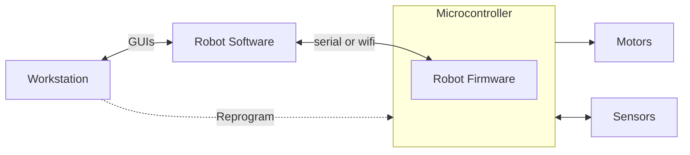
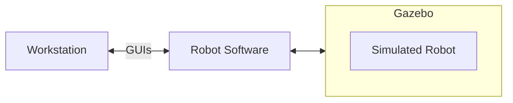
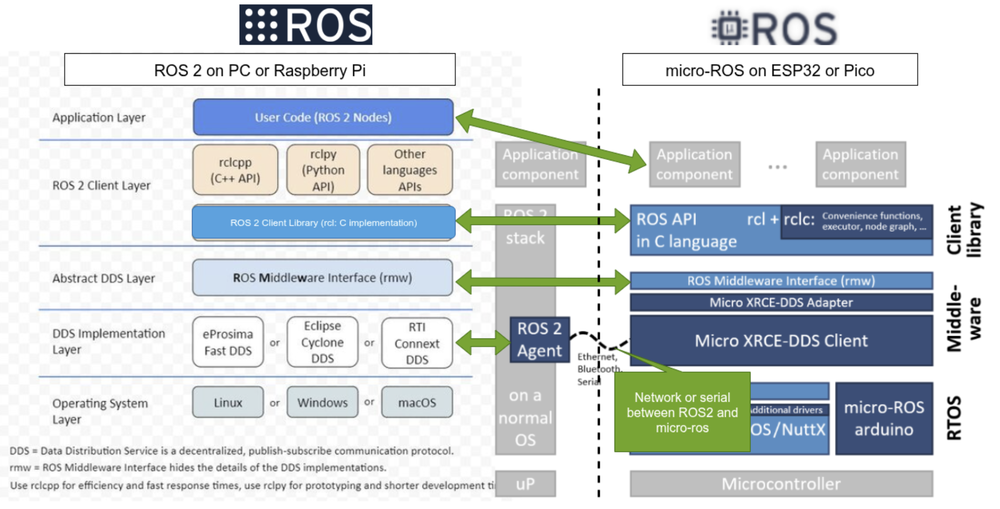

# Linorobot2 Architecture

## System Architecture

This section describes the system architecture within which a linorobot2 robot
runs.

### Physical Robot

The architecture of a system that includes a linorobot2 Physical Robot is shown below.

The Workstation provides the user a way to start Robot Software, as
well as to visualize the robot and its data using ROS GUI tools like
Rviz and rqt. It also runs the Robot Firmware build system (PlatformIO),
and reprograms the Microcontroller with Robot Firmware updates.

The Robot Software includes linorobot2 packages from this repo, as
well as the Nav2 navigation packages and other ROS packages. It is ROS
software that runs the navigation algorithms that enable the robot to
make maps and autonomously navigate using them. Robot Software may run
on an onboard Robot Computer that uses a USB serial link to communicate
with Robot Firmware. Alternatively, it may run on the Workstation and
use wifi to communicate with Robot Firmware.

The Robot Firmware runs on the onboard Microcontroller, accepts motion
commands from Robot Software, and translates them into hardware actions
that turn the wheel motors. It also reads the sensors and passes their
data back to Robot Software. Robot Firmware runs high-frequency
real-time control loops with good predictability, offloading that task
from the Robot Computer.

### Simulated Robot

The architecture of a system that includes a linorobot2 Simulated Robot
is shown below.

As with the Physical Robot, the Workstation provides the user a way to
start Robot Software and the Gazebo physics simulator, as well as to
visualize the robot and its data using ROS GUI tools like Rviz and rqt.

The Robot Software is the same as in a Physical Robot - it includes
linorobot2 packages from this repo, as well as the Nav2 navigation
packages and other ROS packages. It is the ROS software that runs the
navigation algorithms that enable the robot to make maps and autonomously
navigate using them. Robot Software and Gazebo may run on the Workstation,
or up in the cloud.

The Gazebo simulator runs a simulation of the robot and its interactions
with a simulated world. It has the same interfaces to Robot Software as
the Physical Robot.

The fact that Gazebo provides the same interfaces as the Physical Robot
enables it to simulate a "digital twin" of the Physical Robot. No changes
in Robot Software are needed to switch between the Physical Robot itself
and the Simulated Robot that mirrors the Physical Robot.

## Architectural Goals

The architectural goals of linorobot2 and linorobot2_hardware are
to enable ROS2 navigation, both on Physical Robot hardware and for
a Simulated Robot running in a gazebo simulation, for a variety of
differential-drive, skid-steer, and meccanum robots, and to do this with
a high degree of parameterization of robot hardware characteristics and
sensors and motor drivers.

This should result in reduced development effort for robot software
and firmware.

Physical Robot hardware includes a Microcontroller running low-level
high-frequency tasks in Robot Firmware and communicating to Robot Software
on a Robot Computer and/or Workstation using the micro-ros transport.
Micro-ros is central to the architecture, and enables Microcontroller
firmware to flexibly subscribe and publish to ROS topics on the Robot
Computer or Workstation, provide service servers, and generally be a
part of the ROS node graph.

The architecture includes extension points for users to add customizations
for their robots in such a way that they don't conflict with ongoing
maintenance and upgrades to the linorobot2 packages. This enables
upgrading linorobot2 software and firmware, hopefully with minimal impact
to the user's robot software and configurations in many cases.  Proper use
of extension points also enables users to give back upgrades to the core
linorobot2 software and firmware without disrupting their customizations.

Once the robot's URDF has been configured in the linorobot2_description
package, users can easily switch between launching the Physical Robot
and spawning the Simulated Robot in Gazebo.

## Architecture

The figure below shows the major subsystems and launch files for running
on real hardware and in simulation.

Assuming you're using supported sensors and motor drivers, linorobot2
automatically launches the necessary hardware drivers, with the topics
being conveniently matched with the topics available in Gazebo. This
allows users to define parameters for high level applications (ie. Nav2
SlamToolbox, AMCL) that are common to both virtual and physical robots.

The figure below summarizes the topics available after launching a connection to a hardware robot by running **bringup.launch.py**. It also shows the functions assigned to the microcontroller for physical robot control.

The diagram below shows a communication protocol stack view of Robot Software and
Robot Firmware, and how they relate.

The software stack on the left half of the diagram shows the layers of Robot
Software running on the Robot Computer. The software stack on the right
half of the diagram shows the layers of Robot Firmware running on the
Microcontroller. Conceptually, layers at a similar level in both stacks
can be considered to communicate with each other. The layers are described
below, starting from the bottom.

The Robot Software can be considered "ROS" software. The Robot Firmware
can be considered micro-ros firmware.

### OS layer

Robot Software (the ROS2 nodes) run on the Robot Computer operating system.
It is built by colcon and launched by the user with ros2 launch and run commands,
after the Robot Computer has booted.

Robot Firmware runs in the Arduino environment on the Microcontroller - there
is no operating system. It is built by PlatformIO and starts as soon as the
Microcontroller is powered on and boots.

### DDS Implementation Layer

Robot Software uses one of several supported variants of DDS transport to pass
messages between ROS nodes. The bringup launch file starts the ROS2 Agent
which tries to establish communication with Robot Firmware.

Robot Firmware uses the Micro XRCE-DDS client to pass DDS messages between
firmware layers above it and a ROS2 Agent running on the Robot Computer.

When Robot Firmware starts, the XRCE-DDS client attempts to establish
communication with the ROS2 Agent, and waits until that handshake suceeds.
Once the XRCE-DDS client has established communication with the ROS2 Agent,
DDS messages can flow between Robot Software and Robot Firmware, and
subscriptions and publications can be set up between Robot Software
and Firmware.

### Abstract DDS Layer

This layer is a thin shim which abstracts the differences between DDS
implementations, so that the libraries in the ROS Client layer see
a consistent interface to the DDS transport.

### ROS Client Layer

This is the most important layer of the architecture - it provides the
ROS semantics (publish, subscribe, create_timer, and many more) to
application-level software and firmware above it. Importantly, the rcl
(Ros Client Library) is the same code running on both the Robot
Computer and the Microcontroller, which ensures the API for application software
is consistent.

The rcl library provides a 'C' interface to both the Robot Software clients
and Robot Firmware clients. However, Robot Software (ROS) provides language-specific
shim libraries (rclcpp for C++, rclpy for python), whereas Robot Firmware does not.
Therefore, applications in Robot Software are written to a C++ or Python interface
spec, wherease applications in Robot Firmware are written to a C interface spec.
Nevertheless, the same semantics (subscriptions, publications, timers, services)
are maintained in both environments. For this reason, application code in
Robot Software looks different than application code in Robot Firmware - they
are written in different languages (C++ or python for software, C for firmware).

If you keep in mind that the same semantics are provided in the C++, python, and
C environments, you can pretty easily understand all of them.

The rcl library in Robot Software can be considered to communicate with the rcl
library in Robot Firmware in the sense that if a firmware client subscribes to a
topic, the firmware rcl library ensures that its caller will get callbacks
when a software client publishes to that topic.

An important aspect of the ROS Client layer is it includes interface
message definitions.  This means that all the standard ROS messages can
be used by firmware, and custom interface message types defined using
message-generation tools can also be used by firmware. Therefore it is
possible to define robot-specific interface messages and use them in both
Robot Software and Robot Firmware without any change to the message-passing
layers.

### Application Layer

The application layer is where Robot Software nodes communicate with robot-specific
firmware. For example, navigation software can publish motion commands on
the /cmd_vel topic to firmware that will operate the motor drivers,
and firmware can publish robot data like odometry on the /odom topic
to navigation software.

## Micro-ros

Broadly, micro-ros is the firmware that runs in the Arduino environment and
provides services to robot-specific application firmware. 

## linorobot_hardware

The [linorobot2_hardware](https://github.com/linorobot/linorobot2_hardware) repo
contains the application-layer part of Robot Firmware, and the build configurations
that pull in micro-ros and Arduino to build a working firmware. It contains
configuration files that allow customization of the application layer
to your specific robot.

linorobot_hardware is in a separate repo from Robot Software because its
build processes and operations are very different from ROS software. Nevertheless
it is an integral part of a linorobot2 Physical Robot.