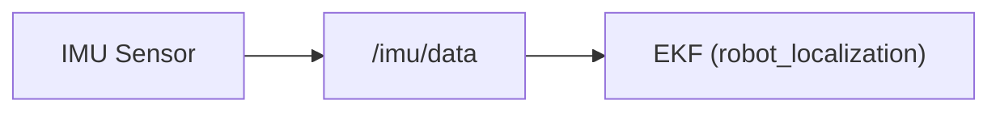
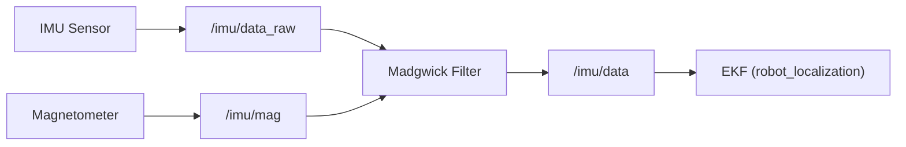

# Base Controller

## What Is the Base Controller?

The base controller is the bridge between the ROS2 world and your robot's wheels. When Nav2 wants the robot to move, it publishes a velocity command. Something has to take that command and turn it into actual motor signals, spinning wheels at the right speed in the right direction. That's the base controller's job.

In linorobot2, the base controller lives on a microcontroller (such as a Pico) that is separate from the main Robot Computer. The microcontroller runs [micro-ROS](https://micro.ros.org/), a lightweight version of the ROS2 client library designed for resource-constrained embedded systems. This lets the microcontroller act as a first-class ROS2 node, publishing and subscribing to topics just like any other node on the network.


## What It Does

The base controller's primary job is to translate high-level velocity commands into low-level motor control:

1. **Receives** a `geometry_msgs/Twist` message on `/cmd_vel`, which contains the desired linear velocity (`linear.x`) and angular velocity (`angular.z`).
2. **Computes** the required wheel speeds using the robot's kinematic model (differential drive, skid-steer, or mecanum).
3. **Drives** the motor controllers to spin the wheels at the correct speeds.
4. **Reads** the wheel encoders to measure how far each wheel has actually turned.
5. **Publishes** odometry: how far the robot has traveled and how it has rotated, as `nav_msgs/Odometry` on `odom/unfiltered`.

In addition to the drive wheels, the microcontroller also reads an onboard IMU (Inertial Measurement Unit) and publishes its raw data. This IMU data will later be fused with wheel odometry to produce a more accurate position estimate. That's covered in the [Odometry](04_odometry.md) section.

## Topics

| Topic | Message Type | Direction | Description |
|-------|-------------|-----------|-------------|
| `/cmd_vel` | `geometry_msgs/Twist` | Subscribed | Velocity commands from Nav2 or teleop |
| `odom/unfiltered` | `nav_msgs/Odometry` | Published | Raw wheel odometry |
| `/imu/data` | `sensor_msgs/Imu` | Published | IMU data. Published directly by the firmware when no magnetometer is used, or by the Madgwick filter when magnetometer is enabled |
| `/imu/data_raw` | `sensor_msgs/Imu` | Published | Raw IMU acceleration and gyro data (only when magnetometer is enabled) |
| `/imu/mag` | `sensor_msgs/MagneticField` | Published | Magnetometer data (only when magnetometer is present) |

## Implementation

All firmware for the microcontroller is maintained in the [linorobot2_hardware](https://github.com/linorobot/linorobot2_hardware) repository. That's where you'll find:

- Firmware code for configuring your motor drivers and encoders
- Instructions for flashing the firmware to your Pico or compatible board
- Configuration for different robot base types (2WD, 4WD, Mecanum) as well as for different motor controllers and sensors

## Booting Up

In the next steps of this guide (mapping, navigation), you will always start by booting the Robot Computer first. Depending on your setup, you'll run one of the following:

**Physical Robot:**
```bash
ros2 launch linorobot2_bringup bringup.launch.py
```

**Simulated Robot:**
```bash
ros2 launch linorobot2_gazebo gazebo.launch.py spawn_x:=0.5
```

- `spawn_y`, `spawn_z`, can also be used to set the initial position of the Simulated Robot in Gazebo.

The rest of this section covers what each of these actually does under the hood.

### Physical Robot

When you run `bringup.launch.py`, the Robot Computer starts a micro-ROS agent that opens a serial connection to the microcontroller and bridges its topics into the ROS2 network.

Always wait for the agent to confirm a successful connection before running SLAM or navigation. You'll see something like:

```
| Root.cpp             | create_client     | create
| SessionManager.hpp   | establish_session | session established
```

If it takes longer than 30 seconds, try unplugging and re-plugging the microcontroller's USB cable.

By default, the agent connects over serial on `/dev/ttyACM0`. You can change this:

```bash
# Different serial port
ros2 launch linorobot2_bringup bringup.launch.py base_serial_port:=/dev/ttyACM1

# Higher baud rate
ros2 launch linorobot2_bringup bringup.launch.py base_serial_port:=/dev/ttyUSB0 micro_ros_baudrate:=921600

# WiFi transport (UDP)
ros2 launch linorobot2_bringup bringup.launch.py micro_ros_transport:=udp4 micro_ros_port:=8888
```

### Simulated Robot

In Gazebo, there is no physical microcontroller, but the same interface is preserved. Gazebo uses **plugins** defined in the robot's URDF to simulate the base controller and IMU, publishing on the same topics so the rest of the stack (EKF, SLAM, Nav2) works identically.

#### Differential Drive Controller

The drive controller is defined in `linorobot2_description/urdf/controllers/diff_drive.urdf.xacro`:

```xml
<plugin
  filename="gz-sim-diff-drive-system"
  name="gz::sim::systems::DiffDrive">
  <topic>cmd_vel</topic>
  <child_frame_id>base_footprint</child_frame_id>
  <odom_topic>odom/unfiltered</odom_topic>
  <left_joint>left_wheel_joint</left_joint>
  <right_joint>right_wheel_joint</right_joint>
  <wheel_separation>${wheel_separation}</wheel_separation>
  <wheel_radius>${wheel_radius}</wheel_radius>
  <odom_publish_frequency>50</odom_publish_frequency>
</plugin>
```

This plugin does what the microcontroller firmware does on the Physical Robot:

- Subscribes to `cmd_vel` for incoming `Twist` velocity commands
- Converts them to per-wheel velocities using the kinematic model, driven by `wheel_separation` and `wheel_radius`
- Publishes wheel odometry to `odom/unfiltered` at 50 Hz

The `wheel_separation` and `wheel_radius` values are passed in from the robot's URDF (e.g. `linorobot2_description/urdf/robots/2wd.urdf.xacro`) using the values defined in `<robot_type>_properties.urdf.xacro`. If you change the robot's dimensions in the properties file, the controller picks them up automatically.

#### IMU

The simulated IMU is defined in `linorobot2_description/urdf/sensors/imu.urdf.xacro`:

```xml
<plugin filename="gz-sim-imu-system" name="gz::sim::systems::Imu"/>

<sensor name="imu_sensor" type="imu">
  <topic>imu/data</topic>
  <update_rate>50</update_rate>
</sensor>
```

It publishes directly to `imu/data` at 50 Hz, the same topic the EKF reads in `ekf.yaml`. Both the diff drive controller and the IMU are already included in every robot URDF under `linorobot2_description/urdf/robots/`, so no extra configuration is needed to run the Simulated Robot.

## Magnetometer Support (Physical Robot)

The sensor suite for a Physical Robot can include a magnetometer that can provide
absolute heading (compass direction). How IMU data reaches the EKF depends on whether the magnetometer is enabled.

**Without Magnetometer (default):**



**With Magnetometer enabled (`madgwick:=true`):**



The magnetometer is disabled by default because it requires calibration. When enabled, the firmware switches to publishing raw IMU data on `/imu/data_raw` and magnetometer data on `/imu/mag`. A Madgwick filter then fuses these two inputs and publishes the result on `/imu/data` with a calibrated orientation estimate:

```bash
ros2 launch linorobot2_bringup bringup.launch.py madgwick:=true orientation_stddev:=0.01
```

If you enable the magnetometer, you'll also need to update `ekf.yaml` to use the yaw from the fused IMU. Both the IMU and magnetometer must be calibrated first. An uncalibrated magnetometer will cause the robot's pose to drift and rotate unpredictably.

## What's Next

Once the base controller is running and connected, you have a robot that can receive velocity commands and report its position. The next step is to make that position estimate more reliable using sensor fusion. See [Odometry](../odometry/).
