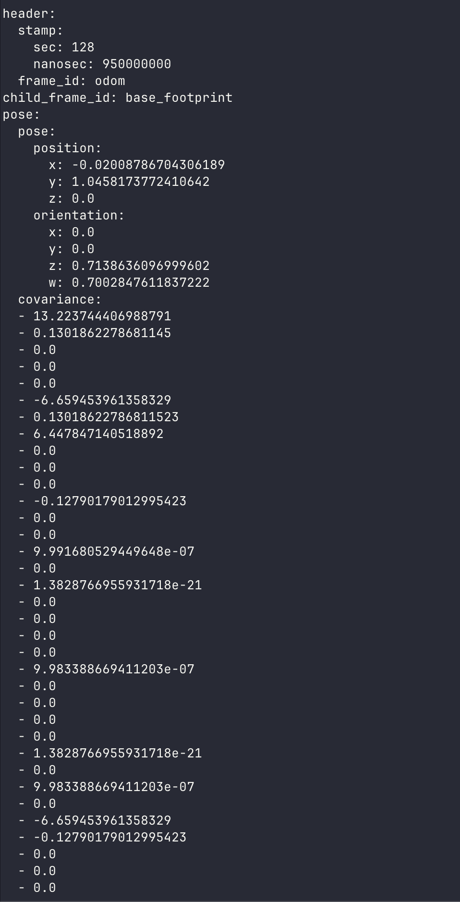

# Odometry

## What Is Odometry?

Odometry is the robot's best estimate of where it is, based on how much it has moved. Every time a wheel turns, the encoder counts the pulses. From the pulse count, the firmware computes how fast each wheel is spinning, then uses the robot's kinematics to figure out the robot's linear and angular velocity, and finally integrates those velocities over time to estimate the robot's current position and orientation.

Think of it like navigating with a car's trip odometer: you know how fast you've been going and for how long, so you can estimate how far you've traveled, even without GPS.

## How Odometry Is Computed

### Physical Robot

On the Physical Robot, odometry is calculated inside the microcontroller firmware. The full implementation is in [odometry.cpp](https://github.com/linorobot/linorobot2_hardware/blob/jazzy/firmware/lib/odometry/odometry.cpp). In summary:

1. Encoder pulses are counted for each wheel since the last update.
2. Pulse counts are converted to wheel displacement using the wheel circumference and encoder resolution.
3. Left and right displacements are combined using the differential drive kinematic equations to compute the robot's linear displacement and heading change.
4. The resulting linear and angular velocities are integrated to update the robot's pose.

The computed odometry is published to `odom/unfiltered` via micro-ROS.

### Simulated Robot

In Gazebo, the `gz-sim-diff-drive-system` plugin in `linorobot2_description/urdf/controllers/diff_drive.urdf.xacro` handles this. It reads the simulated joint states of the left and right wheel joints, applies the same differential drive kinematics using the configured `wheel_separation` and `wheel_radius`, and publishes the result to `odom/unfiltered` at 50 Hz. The upstream consumers (EKF, SLAM, Nav2) see no difference.

In ROS2, odometry is published as a `nav_msgs/Odometry` message, which contains the robot's estimated pose (position + orientation) and its current velocity.

## Why Wheel Odometry Alone Isn't Enough

Wheel odometry works well in short bursts, but it accumulates errors over time. The main culprits are:

- **Wheel slip:** wheels sliding on smooth or slippery surfaces produce encoder counts that don't correspond to actual motion.
- **Uneven surfaces:** bumps and ramps tilt the robot, so straight-line motion in 3D gets projected incorrectly onto the 2D floor plane.
- **Mechanical tolerances:** small differences in wheel diameter or encoder resolution cause the robot to drift even when driving in a straight line.

Over a long mapping session or navigation run, these errors accumulate. The robot thinks it's at position X, but it's actually somewhere slightly different. SLAM Toolbox and AMCL can compensate for some of this using their sensor matching, but giving them a better starting estimate makes their job much easier.

## Improving Odometry with an IMU

The robot's microcontroller also has an IMU (Inertial Measurement Unit) that measures acceleration and angular velocity directly. Specifically, the gyroscope in the IMU measures rotational rate very precisely, which means it can accurately track how fast the robot is turning.

Wheel encoders track rotation indirectly (via encoder pulses), while the IMU measures it directly. By combining (fusing) both sources, you get an estimate that is better than either one alone. The wheel odometry provides the linear motion, and the IMU provides better angular tracking.

## Sensor Fusion with robot_localization

linorobot2 uses the [robot_localization](https://docs.ros.org/en/ros2_packages/rolling/api/robot_localization/index.html) package to perform this sensor fusion. It implements an Extended Kalman Filter (EKF), a standard algorithm for combining noisy sensor measurements into a single optimal estimate.

### Installation

```bash
sudo apt install ros-$ROS_DISTRO-robot-localization
```

This is installed automatically by the `install.bash` script.

### Configuration

The EKF is configured in `linorobot2_base/config/ekf.yaml`:

```yaml
ekf_filter_node:
    ros__parameters:
        frequency: 50.0        # Output rate in Hz
        two_d_mode: true       # Constrains motion to the 2D plane (floor robots)
        publish_tf: true       # Publishes the odom -> base_footprint transform

        map_frame: map
        odom_frame: odom
        base_link_frame: base_footprint
        world_frame: odom

        odom0: odom/unfiltered
        odom0_config: [false, false, false,  # x, y, z position
                       false, false, false,  # roll, pitch, yaw
                       true,  true,  false,  # vx, vy, vz  <-- use wheel velocities
                       false, false, true,   # vroll, vpitch, vyaw  <-- use yaw rate
                       false, false, false]  # ax, ay, az

        imu0: imu/data
        imu0_config: [false, false, false,
                      false, false, false,
                      false, false, false,
                      false, false, true,   # vyaw  <-- fuse IMU yaw rate
                      false, false, false]
```

**Key parameters explained:**

- `frequency: 50.0`: The EKF runs at 50 Hz, producing filtered odometry 50 times per second.
- `two_d_mode: true`: Tells the filter to ignore roll and pitch, appropriate for ground robots.
- `publish_tf: true`: The EKF publishes the `odom → base_footprint` transform directly, which is required by Nav2.
- `odom0: odom/unfiltered`: The raw wheel odometry input, published directly by the microcontroller firmware (Physical Robot) or the Gazebo diff drive plugin (Simulated Robot).
- `imu0: imu/data`: The IMU input. By default this is the raw IMU data; if you enable the Madgwick filter, this becomes the orientation-fused output.
- The `_config` arrays select which states to use from each sensor. The `true` entries tell the EKF which measurements to trust from each source.

### Topics

| Topic | Type | Description |
|-------|------|-------------|
| `odom/unfiltered` | `nav_msgs/Odometry` | Raw wheel odometry (microcontroller or Gazebo plugin) |
| `imu/data` | `sensor_msgs/Imu` | IMU data (raw, or Madgwick-fused if enabled) |
| `/odom` | `nav_msgs/Odometry` | **Output**: fused odometry from the EKF |

The EKF's output topic defaults to `/odom` and can be changed via the `odom_topic` argument in `bringup.launch.py`:

```bash
ros2 launch linorobot2_bringup bringup.launch.py odom_topic:=/my_odom
```

The EKF also publishes the `odom → base_footprint` TF transform, which is what Nav2, SLAM Toolbox, and AMCL all rely on to know where the robot is within the odometry frame.

## Verifying Odometry

Before running SLAM or navigation, it's worth verifying that your odometry is working correctly. Poor odometry leads to bad maps and failed navigation.

**Test 1: Drive forward 1 meter**

Rotate the robot 90 degrees CCW or CW and drive it forward 1 meter using teleop, then check the `/odom` topic:

```bash
ros2 topic echo /odom
```

The `pose.pose.position.x` value should be approximately `1.0`. If it reads significantly more or less, check your wheel radius and encoder configuration in the firmware.



**Test 2: Rotate 360 degrees**

Rotate the robot a full turn in place, then check that the position returns close to its starting point and the yaw is approximately back to 0. Large drift here usually indicates a wheel separation (track width) misconfiguration.

**Test 3: Visualize in RViz**

Launch RViz and add an `Odometry` display subscribing to `/odom`. Drive the robot around and watch the pose arrow, which should move smoothly and realistically.

## What's Next

With reliable odometry established, the robot knows where it is within a local coordinate frame. The next step is to add sensors (lidar and depth cameras) so the robot can perceive its environment. See [Setting Up Sensors](../sensors/).
