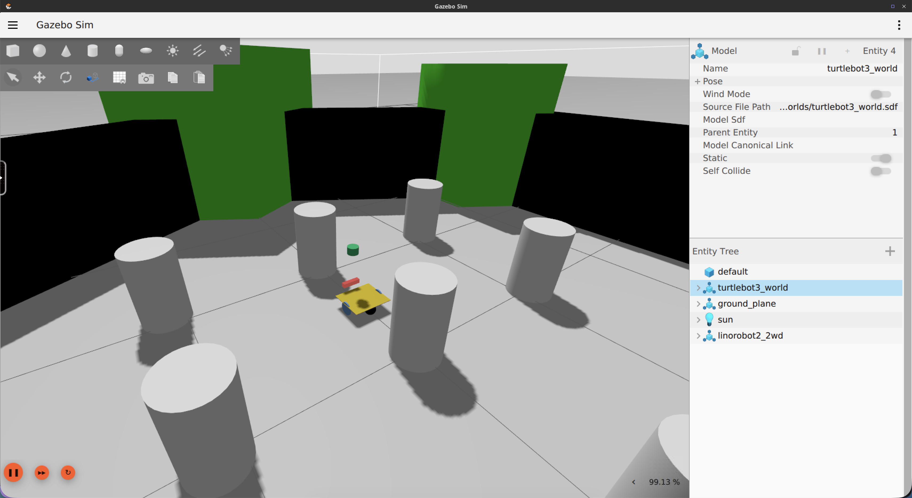
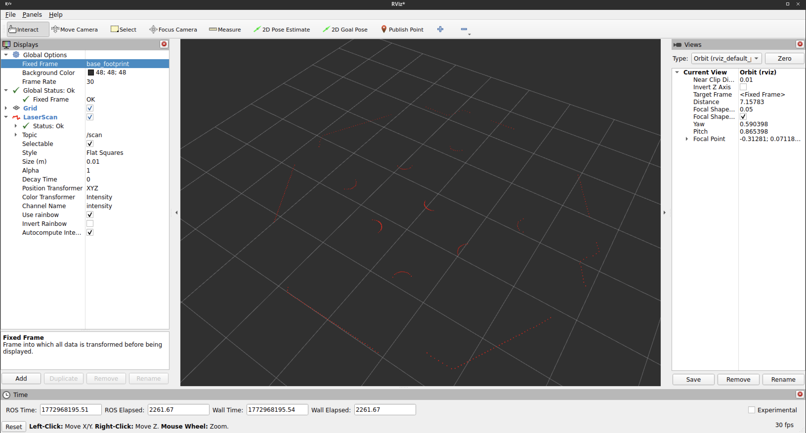

# Setting Up Sensors

## Why Sensors Matter

Odometry tells the robot where it *thinks* it is based on how far its wheels have turned. Sensors tell the robot what's actually around it. Without sensors, the robot is blind. It can't detect obstacles, can't build a map of its environment, and can't localize itself within a map.

linorobot2 uses two primary sensor categories:

- **LaserScan (2D lidar):** produces a 360° ring of distance measurements on a flat plane. This is the primary sensor for obstacle detection and SLAM.
- **Depth camera (RGBD):** produces a 3D point cloud and/or depth image. Useful for detecting obstacles that a floor-level lidar misses (like table legs above the scan plane).

Both sensor types publish data that Nav2 and SLAM Toolbox consume directly.

## Physical Robot Setup

On a physical robot, sensors are configured during installation via the `install.bash` script's `--laser` and `--depth` arguments. The script installs the appropriate ROS2 driver packages and sets environment variables that the bringup launch files use to start the correct driver at boot.

### Supported Laser Sensors

| Argument | Sensor |
|----------|--------|
| `a1` | [RPLIDAR A1](https://www.slamtec.com/en/Lidar/A1) |
| `a2` | [RPLIDAR A2](https://www.slamtec.ai/product/slamtec-rplidar-a2/) |
| `a3` | [RPLIDAR A3](https://www.slamtec.ai/product/slamtec-rplidar-a3/) |
| `s1` | [RPLIDAR S1](https://www.slamtec.com/en/Lidar/S1) |
| `s2` | [RPLIDAR S2](https://www.slamtec.com/en/Lidar/S2) |
| `s3` | [RPLIDAR S3](https://www.slamtec.com/en/Lidar/S3) |
| `c1` | [RPLIDAR C1](https://www.slamtec.ai/product/slamtec-rplidar-a3/) |
| `ld06` | [LD06 LIDAR](https://www.ldrobot.com/ProductDetails?sensor_name=STL-06P) |
| `ld19` | [LD19/LD300 LIDAR](https://www.ldrobot.com/ProductDetails?sensor_name=STL-19P) |
| `stl27l` | [STL27L LIDAR](https://www.ldrobot.com/ProductDetails?sensor_name=STL-27L) |
| `ydlidar` | [YDLIDAR](https://www.ydlidar.com/lidars.html) |
| `xv11` | [XV11](http://xv11hacking.rohbotics.com/mainSpace/home.html) |
| `realsense` * | [Intel RealSense](https://www.intelrealsense.com/stereo-depth/) D435, D435i |
| `zed` * | [Zed](https://www.stereolabs.com/zed) |
| `zed2` * | [Zed 2](https://www.stereolabs.com/zed-2) |
| `zed2i` * | [Zed 2i](https://www.stereolabs.com/zed-2i) |
| `zedm` * | [Zed Mini](https://www.stereolabs.com/zed-mini) |

Sensors marked with `*` are depth cameras used as laser sensors. When configured this way, the launch files automatically run [depthimage_to_laserscan](https://github.com/ros-perception/depthimage_to_laserscan) to convert the depth image into a `sensor_msgs/LaserScan` message on the `/scan` topic, making it compatible with SLAM Toolbox and Nav2 without any extra configuration.

### Supported Depth Sensors

| Argument | Sensor |
|----------|--------|
| `realsense` | [Intel RealSense](https://www.intelrealsense.com/stereo-depth/) D435, D435i |
| `zed` | [Zed](https://www.stereolabs.com/zed) |
| `zed2` | [Zed 2](https://www.stereolabs.com/zed-2) |
| `zed2i` | [Zed 2i](https://www.stereolabs.com/zed-2i) |
| `zedm` | [Zed Mini](https://www.stereolabs.com/zed-mini) |
| `oakd` | [OAK-D](https://shop.luxonis.com/collections/oak-cameras-1/products/oak-d) |
| `oakdlite` | [OAK-D Lite](https://shop.luxonis.com/collections/oak-cameras-1/products/oak-d-lite-1) |
| `oakdpro` | [OAK-D Pro](https://shop.luxonis.com/collections/oak-cameras-1/products/oak-d-pro) |

## Simulated Robot

In Gazebo, sensors are defined in URDF/xacro files and are already configured for each robot type. You don't need to install any additional drivers. Gazebo simulates the sensors and publishes on the same topics as real hardware.



### Sensor URDF Files

Sensor definitions live in `linorobot2_description/urdf/sensors/`:

**`generic_laser.urdf.xacro`:** Simulates a 360° 2D lidar:

- 360 rays, full 360° sweep
- Range: 0.08 m to 12.0 m
- Update rate: 10 Hz
- Publishes to: `/scan` (topic name: `scan`, frame ID: `laser`)

**`depth_sensor.urdf.xacro`:** Simulates an RGBD camera:

- Resolution: 640 × 480
- Update rate: 30 Hz
- Horizontal FOV: ~86°
- Depth range: 0.3 m to 100 m
- Publishes to: `/camera` topics

**`imu.urdf.xacro`:** Simulates an IMU:

- Publishes to: `/imu/data` at 50 Hz

### How Sensors Are Included

Each robot type's URDF (`linorobot2_description/urdf/robots/<robot_type>.urdf.xacro`) already includes the laser and depth sensor:

```xml
<xacro:generic_laser>
  <xacro:insert_block name="laser_pose" />
</xacro:generic_laser>

<xacro:depth_sensor>
  <xacro:insert_block name="depth_sensor_pose" />
</xacro:depth_sensor>
```

The `laser_pose` and `depth_sensor_pose` blocks define where the sensors are mounted relative to `base_link`. These are defined in the robot's properties file.

### Configuring Sensor Positions

Sensor positions are set in `linorobot2_description/urdf/<robot_type>_properties.urdf.xacro`. For example, in `2wd_properties.urdf.xacro`:

```xml
<xacro:property name="laser_pose">
  <origin xyz="0.12 0 0.33" rpy="0 0 0"/>
</xacro:property>

<xacro:property name="depth_sensor_pose">
  <origin xyz="0.14 0.0 0.045" rpy="0 0 0"/>
</xacro:property>
```

All positions are measured from `base_link` (the point about which the robot rotates).
On a differential drive or skid steer robot this is typically the midpoint between
the driving wheels. Change these values to match where your sensors are physically
mounted. After editing the xacro file, rebuild the workspace:

```bash
cd <robot_computer_ws>
colcon build
```

More details on how these poses relate to the TF tree are covered in the [Transforms](06_transforms.md) section.

## Published Topics

After bringup (Physical Robot) or Gazebo launch (Simulated Robot), the following sensor topics should be active:

| Topic | Type | Source |
|-------|------|--------|
| `/scan` | `sensor_msgs/LaserScan` | 2D lidar or depth-to-laser conversion |
| `/camera/image_raw` | `sensor_msgs/Image` | Depth camera RGB image |
| `/camera/depth/image_raw` | `sensor_msgs/Image` | Depth camera depth image |
| `/imu/data` | `sensor_msgs/Imu` | IMU data. Published directly by the firmware (no magnetometer) or by the Madgwick filter (magnetometer enabled). In the Simulated Robot, published by `imu.urdf.xacro` |
| `/imu/data_raw` | `sensor_msgs/Imu` | Raw IMU acceleration and gyro data (Physical Robot only, when magnetometer is enabled) |
| `/imu/mag` | `sensor_msgs/MagneticField` | Magnetometer data (Physical Robot only, when magnetometer is present) |

You can verify a sensor is publishing correctly with:

```bash
ros2 topic hz /scan
```



## What's Next

With sensors publishing data, the next step is to make sure the robot knows *where* those sensors are mounted in 3D space, so it can correctly interpret a laser hit at angle X as being at a specific position in the world. That's the job of the TF tree, covered in [Setting Up Transforms](../transforms/).
