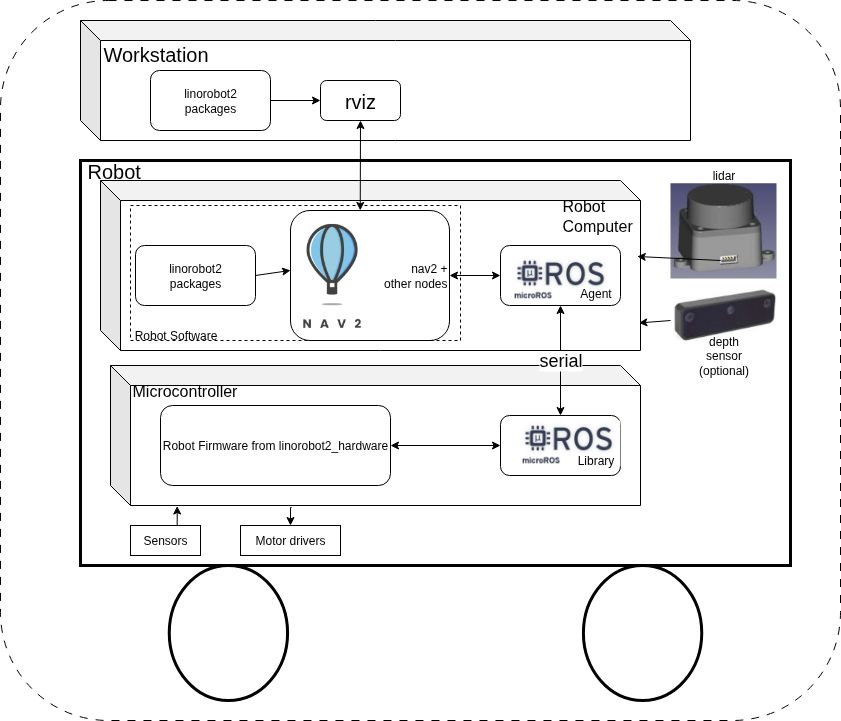
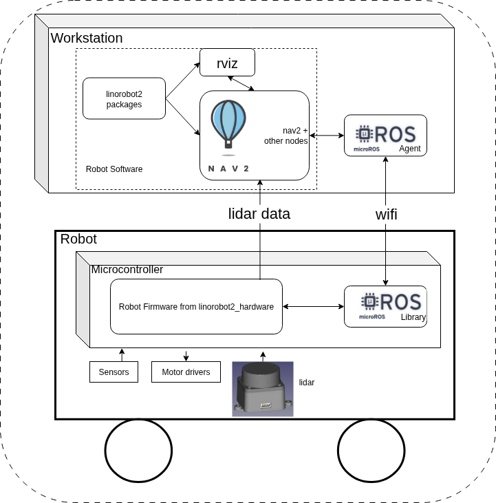
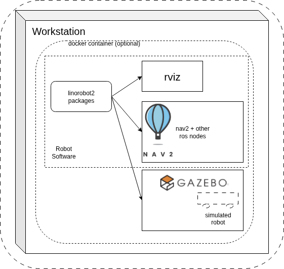
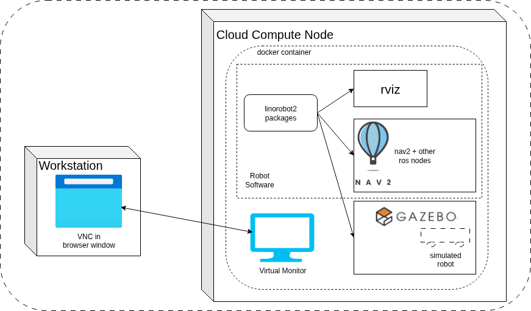

# System Configurations

This page describes the supported system configurations of linorobot2.

## Physical Robot Configurations

The following two configurations are supported for a Physical Robot.

### Onboard Robot Computer configuration

This configuration features a computer mounted on the
robot that runs ROS and communicates with the Microcontroller.
As well, the network-connected Workstation provides for running
Rviz and other graphical programs on a desktop while the Physical Robot
moves around. The Robot Computer Config is shown below.

Linorobot2 is installed on both the Workstation and the Robot Computer. A
linorobot2 launchfile starts Rviz on the workstation.
Other linorobot2 launchfiles on the Robot Computer start robot bringup and Nav2.

The firmware running on the Microcontroller publishes sensor
data to Robot Software, which enables Nav2
to run SLAM and path planning and navigation algorithms which
in turn publish motion commands back to the Robot Firmware running
on the Microcontroller. Microcontroller Firmware runs PID loops and
directs motor drivers to move the wheels.

The micro-ROS agent on the Robot Computer publishes and subscribes
to Robot Software topics on the Robot Computer and passes topic messages
to the micro-ROS library in Robot Firmware, which makes them available
for Robot Firmware use.

High bandwidth sensors like lidar and depth camera are
connected directly to the Robot Computer.

#### Advantages
- Robot navigation is wholly contained on the robot, making it independent
of network connectivity and thus more robust.

#### Disadvantages
- Robot Computer brings extra power requirements, weight and cost

### Robot Wifi Configuration

This configuration supports simple, low-hardware-cost robots by
eliminating the Robot Computer hardware. The Workstation
runs the Robot Software, as well
as Rviz and other graphical programs. The Workstation communicates over
wifi with an ESP32 Microcontroller on the Physical Robot. This config takes
advantage of micro-ros' ability to use either serial
or wifi links. The Robot Wifi config is shown below.

Robot Firmware running on the Microcontroller
publishes sensor data to Robot Software running on the Workstation, which enables
Nav2 to run SLAM and path planning and navigation algorithms that in
turn publish motion commands to Robot Firmware on the Microcontroller. The firmware
runs PID loops and directs motor drivers to move the wheels.

The micro-ROS agent running on the Workstation publishes and subscribes to
ROS topics from the Robot Computer software and passes topic messages over a wifi
connection to the micro-ROS library on the Microcontroller, which makes them available
to firmware.

Lidar sensor data is passed directly from the input serial port of the
Microcontroller over wifi to a UDP port on the Workstation.

#### Advantages
- Lowest cost configuration eliminates Robot Computer hardware
- Lower power, weight

#### Disadvantages
- Only supported on ESP32 microcontrollers (bandwidth on wifi-enabled
Pico microcontrollers is insufficient.)
- Limited number of lidar sensors supported by firmware
- Dependent on excellent wifi connectivity. Depending on the wifi network,
dead-spots may interrupt navigation and desired frame rate may not be achieved

## Simulated Robot Configurations

The following configurations are supported for simulating robots.

### Workstation Simulation Configuration

This configuration runs a gazebo simulation of the robot,
Robot Computer software, and Rviz and other graphical programs on the
Workstation. Only packages from the linorobot2 repo are used - the
linorobot2_hardware repo is not involved (there is no hardware).

This config enables development of robot algorithms prior to putting
them on a Physical Robot. It can optionally be run in a docker
container, meaning the host OS is decoupled from ROS dependencies.

The Workstation Simulation configuration is shown below.

#### Advantages
- Develop and test on a "digital twin" of the Physical Robot
- Test higher-level system components in a repeatable environment
- Eliminate HW-related problems (e.g. hardware malfunctions,
need to reposition robot, battery and comms issues, etc.)

#### Disadvantages
- Hardware model fidelity, especially for sensors, limits 
simulation accuracy
- The ultimate goal is to run on a real robot; simulation can only
be a step on the path to that goal

### Cloud Simulation Configuration

This configuration runs a Simulated Robot in Gazebo.
Robot Software, Rviz and other graphical programs run in a
Docker instance on a virtual computer in the cloud.
Only packages from the linorobot2 repo are used - the
linorobot2_hardware repo is not involved (there is no hardware).
This config enables development of robot algorithms on a really
powerful cloud compute instance prior to putting
them on a Physical Robot.
The Cloud Simulation config is shown below.

#### Advantages
- Same as Workstation simulation
- You can rent higher-performance configurations (e.g. many NVidia GPUs)
to speed up simulation

#### Disadvantages
- Same as Workstation simulation
- You typically pay based on cloud CPU usage. May be more or less expensive
than buying a high-end workstation, depending on your use and needs.
- Using virtual KVM over a VPN and setting up NVidia Cuda libraries in the cloud
adds configuration complexity
