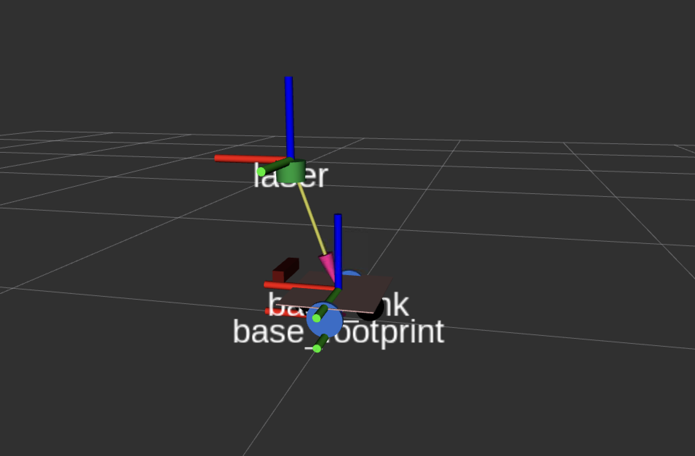

# Setting Up Transforms (TF)

## What Is TF2?

Every sensor, every wheel, every joint on your robot exists somewhere in 3D space. But "somewhere" is only meaningful relative to something else. TF2 is the ROS2 system for tracking these spatial relationships, maintaining a tree of coordinate frames, each with a known position and orientation relative to its parent.

When a laser scan comes in saying "there's an obstacle 0.5 meters ahead," TF2 is what lets the rest of the system answer: "0.5 meters ahead of *what*, and where does that translate to in the map?"

Without a correctly configured TF tree, SLAM can't build a map, Nav2 can't plan a path, and the laser scan won't align with the robot model in RViz.

## The TF Tree in linorobot2

linorobot2 uses the following coordinate frame hierarchy:

```
map
└── odom
    └── base_footprint
        └── base_link
            ├── laser          (2D lidar)
            ├── camera_link    (depth camera)
            └── imu_link       (IMU)
```

Each arrow (`└──`) represents a transform, a known spatial relationship between two frames. Here's what establishes each one:



### `map → odom`

This transform represents the robot's position within the global map. It accounts for the accumulated error in odometry (the difference between where odometry thinks the robot is and where it actually is).

- **During mapping (SLAM Toolbox):** SLAM Toolbox publishes this transform by continuously matching the incoming laser scan against the map it's building.
- **During navigation (AMCL):** AMCL publishes this transform by comparing the laser scan against the pre-built map to localize the robot.

If this transform is missing, you'll see the error: `Invalid frame ID "map" passed to canTransform`. This means SLAM or AMCL isn't running yet, or the robot's initial pose hasn't been set.

### `odom → base_footprint`

This is the robot's odometry-based position estimate of where the robot is within the local odometry frame, based purely on wheel encoders and IMU. It drifts over time (that's what `map → odom` corrects for).

- **Published by:** `robot_localization` (the EKF node), configured via `ekf.yaml`.

`base_footprint` is a 2D projection of the robot's center onto the floor plane, always at z=0. This is the standard frame for ground robots in ROS2.

### `base_footprint → base_link`

A static transform between the 2D floor projection and the actual robot body center. The robot's URDF defines this.

- **Published by:** `robot_state_publisher`, which reads the URDF and publishes all static transforms.

### `base_link → sensors`

Static transforms from the robot body to each sensor. These are also defined in the URDF and published by `robot_state_publisher`.

- `base_link → laser`: Where the 2D lidar is mounted.
- `base_link → camera_link`: Where the depth camera is mounted.
- `base_link → imu_link`: Where the IMU is mounted.

Getting these transforms right is critical. If the lidar is 30 cm forward of center and 33 cm above the ground but your URDF says 0 cm, every laser scan will be placed in the wrong location and SLAM will fail to build a coherent map.

## Configuring Sensor Positions

Sensor positions relative to `base_link` are set in:

```
linorobot2_description/urdf/<robot_type>_properties.urdf.xacro
```

For example, the default 2WD configuration:

```xml
<xacro:property name="laser_pose">
  <origin xyz="0.12 0 0.33" rpy="0 0 0"/>
</xacro:property>

<xacro:property name="depth_sensor_pose">
  <origin xyz="0.14 0.0 0.045" rpy="0 0 0"/>
</xacro:property>
```

The `xyz` values are in meters, measured from `base_link`:

- `x`: forward (positive) / backward (negative) from center
- `y`: left (positive) / right (negative) from center
- `z`: height above the ground plane

The `rpy` values are rotation in radians (roll, pitch, yaw). For a forward-facing sensor mounted level, these are all `0 0 0`.

After editing the xacro file, rebuild the workspace on the robot computer (and also the host machine if you're simulating):

```bash
cd <robot_computer_ws>
colcon build
```

## Visualizing the URDF

Before running SLAM, it's a good idea to check that the robot model and sensor poses look correct.

### From the robot computer:

```bash
ros2 launch linorobot2_description description.launch.py
```

### From the host machine (with RViz):

```bash
ros2 launch linorobot2_viz robot_model.launch.py
```

Or, if working on the host machine directly:

```bash
ros2 launch linorobot2_description description.launch.py rviz:=true
```

In RViz, add the `RobotModel` display and check that the sensor positions match your physical robot.

## Verifying the TF Tree

Once the robot is running (bringup launched, SLAM or AMCL running), you can inspect the full TF tree:

```bash
ros2 run tf2_tools view_frames
```

This generates a `frames.pdf` file showing every frame and the transform that connects it to its parent. Open it and check:

1. All expected frames are present.
2. The tree is connected, with no orphaned frames.
3. Transforms are being published at a reasonable rate.

You can also check individual transforms in real time:

```bash
ros2 run tf2_ros tf2_echo base_link laser
```

This prints the current transform from `base_link` to `laser` every time it updates.

## Common Issues

**Laser scan doesn't align with walls in RViz**
The `laser_pose` in your properties file doesn't match where the sensor is physically mounted. Measure carefully and rebuild.

**`slam_toolbox: Message Filter dropping message: frame 'laser'`**
The TF from `base_footprint` to `laser` isn't arriving fast enough. Try increasing `transform_timeout` in `linorobot2_navigation/config/slam.yaml` by 0.1 until the warning disappears.

**`target_frame - frame does not exist`**
There's likely a syntax error in your `<robot_type>_properties.urdf.xacro`. Check for repeated decimal points or mismatched XML tags.

## What's Next

With the TF tree correctly configured, every sensor reading is spatially grounded, meaning the system knows exactly where in the world each measurement came from. Now you're ready to start building a map. See [Mapping](../mapping/).
